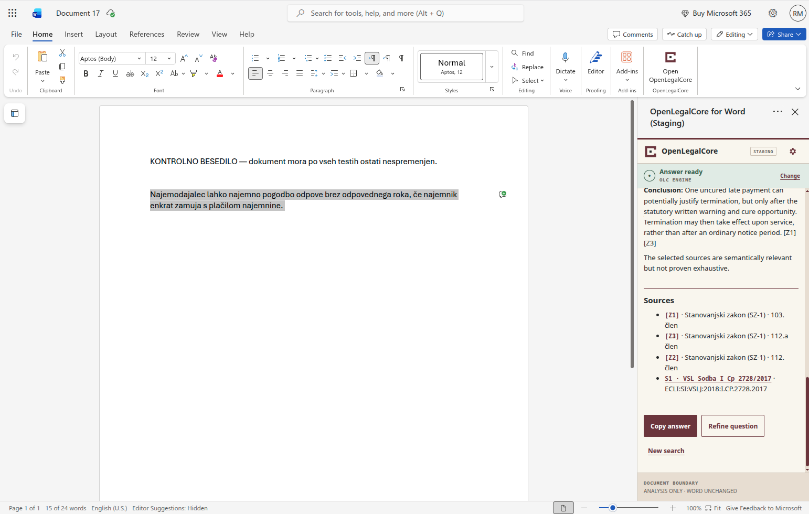
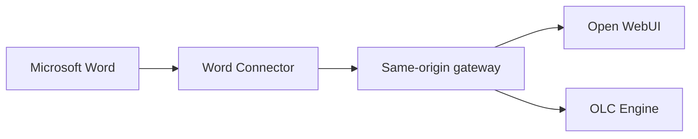

# OpenLegalCore Word Connector

**Verifiable Slovenian legal-source research, directly beside the text you are
reviewing in Microsoft Word.**

<p align="center">
  <a href="docs/assets/screenshots/v0.1/en-US/05-sources-and-actions.png">
    
  </a>
</p>

<p align="center"><sub>Click the preview to open the full-size screenshot.</sub></p>

OpenLegalCore Word Connector is an Apache-2.0 task-pane add-in for researching
Slovenian legislation and case law from Microsoft Word. The user asks a legal
question, chooses whether to include no document content or only the current
selection, and receives an answer with source references without changing the
document.

> [!IMPORTANT]
> `v0.1.0-beta.1` is a source-only beta, not a hosted legal-research service.
> This repository does not include a public backend, legal database, AppSource
> listing, or access to OpenLegalCore's private infrastructure. Live searches
> require an operator-supplied compatible backend and secure same-origin
> gateway.

## At a glance

| | |
| --- | --- |
| **Word host** | Word for the web is verified; Windows and Mac are not yet tested |
| **Legal sources** | Slovenian legislation and case law supplied by the configured backend |
| **Backend paths** | Explicitly selected Open WebUI or OpenAI-compatible OLC Engine |
| **Document context** | No document content, or only the exact selected text |
| **Interface languages** | English (`en-US`) and Slovenian (`sl-SI`) |
| **License** | Apache License 2.0, subject to third-party notices and trademark policy |

## Why this project exists

Legal research often means moving between a document, search tools, legislation
and case-law portals. This connector keeps that research step beside the text
being reviewed while making the boundary around document content explicit.

- **Legal professionals** can ask a question, inspect cited sources, copy an
  answer, refine the question or start again without granting the beta document
  editing capabilities.
- **Developers** get a strict TypeScript codebase, provider-neutral controller,
  isolated Office.js boundary, hardened renderer and deterministic verification
  suite.
- **Partners and operators** can connect an explicitly selected provider while
  retaining control over identity, hosting, credentials, legal corpora,
  retention and operational policy.

The connector supports research; it does not replace an authoritative legal
source or professional judgment. Retrieval coverage, historical validity and
answer quality depend on the configured backend and its data.

## How the workflow works

1. Choose **Open WebUI** or **OLC Engine**.
2. Choose **No document context** or **Selected text**.
3. Enter a legal question and select **Search legal sources**.
4. Review the safely rendered answer and its `Z*` legislation or `S*` case-law
   references.
5. Use **Copy answer**, **Refine question** or **New search**.

See the [English user guide](docs/USER_GUIDE.md),
[Slovenian user guide](docs/USER_GUIDE.sl-SI.md) and
[bilingual product gallery](docs/SCREENSHOTS.md) for the complete workflow.

## Document and trust boundary

- **No document context** never calls the Word selection API and sends no
  document content.
- **Selected text** captures only the exact current selection when the user
  starts the search. The question and quoted selection remain separate fields.
- The beta does not expose or perform document editing, replacement, redlining
  or tracked changes.
- Cancellation, timeout, session expiry, backend failure and late responses
  leave the Word document unchanged.
- Provider selection is explicit. There is no automatic fallback or sharing of
  credentials between providers.
- Model output is untrusted text. Only credential-free HTTPS links on the exact
  approved PISRS and Slovenian case-law hosts can become clickable.

Read the [privacy statement](PRIVACY.md) and [security policy](SECURITY.md)
before evaluating the connector with a real document.

## Choose your starting point

| Goal | Start here | What you need |
| --- | --- | --- |
| Use the connector | [User guide](docs/USER_GUIDE.md) or [slovenski priročnik](docs/USER_GUIDE.sl-SI.md) | Installed add-in and operator-provided access |
| Browse the interface | [Bilingual product gallery](docs/SCREENSHOTS.md) | No installation |
| Preview the UI locally | [Local UI preview](docs/INSTALLATION.md#path-a-local-ui-preview) | Git and Node.js 24 |
| Load the add-in in Word for the web | [Word Web sideload](docs/INSTALLATION.md#path-b-word-for-the-web-development-sideload) | Microsoft 365, Git and Node.js 24 |
| Connect Open WebUI or OLC Engine | [Integration guide](docs/INTEGRATION.md) | Compatible backend and secure same-origin gateway |
| Deploy a connected build | [Connected deployment](docs/INSTALLATION.md#path-c-connected-self-hosted-deployment) | HTTPS hosting, identity and operator infrastructure |
| Review or change the code | [Technical guide](docs/TECHNICAL_GUIDE.md) and [contribution guide](CONTRIBUTING.md) | Development environment |
| Evaluate support claims | [Compatibility and limitations](docs/COMPATIBILITY_AND_LIMITATIONS.md) | No installation |
| Understand future direction | [Roadmap](ROADMAP.md) | No installation |

## Quick local UI preview

This path verifies that the project installs, builds and renders using
synthetic fixtures. It does not read Word or call a legal backend.

```bash
git clone https://github.com/OpenLegalCore/olc-word-connector.git
cd olc-word-connector
npm ci
npm run start:harness
```

Open `https://localhost:3002/harness.html`. If the local development
certificate is not trusted, follow the certificate step in
[Installation and deployment](docs/INSTALLATION.md); do not bypass a warning
for a non-local host.

## Architecture



The Office adapter owns Word access, the controller owns orchestration, each
gateway adapter owns its provider protocol and the view owns safe presentation.
Office proxy objects never enter the HTTP layer, and provider adapters never
mutate Word or the DOM.

The browser bundle accepts neither provider credentials nor private backend
origins. Production requests use same-origin routes with browser-session
credentials; the operator gateway keeps secrets and private-origin credentials
server-side.

See the [integration guide](docs/INTEGRATION.md) for the public backend and
gateway contract, and the [technical guide](docs/TECHNICAL_GUIDE.md) for the
internal runtime, transport, prompt, localization, manifest, build and test
contracts.

## Verification

The Word for the web release-gate walkthrough was accepted on 5 September 2026.
It covered both provider paths, both document-context modes, answer and source
rendering, result actions, cancellation with late-response suppression, secure
session recovery with an explicit retry, and an unchanged Word document.

Windows and Mac remain untested and carry no support claim. Detailed evidence,
limitations and excluded capabilities are recorded in
[Compatibility and limitations](docs/COMPATIBILITY_AND_LIMITATIONS.md).

For a clean verification run:

```bash
npm ci
npm test -- --run
npm run typecheck
npm run lint
npm run validate
npm run build
npm run verify:bundle
```

The included CI workflow validates manifests and audits production dependencies
at high severity. `verify:bundle` rejects test, harness, fake, mutation,
credential-storage, service-token, private-origin and source-map artifacts from
the production bundle. Protected live tests are opt-in and are not part of
ordinary CI.

## Repository map

| Path | Responsibility |
| --- | --- |
| `src/app/` | Provider-neutral workflow, state and cancellation |
| `src/office/` | The only production boundary that uses Office.js |
| `src/chat/` | Open WebUI and OLC Engine protocol adapters |
| `src/taskpane/` | Composition, localization, view models and safe rendering |
| `manifests/` | Development, staging and reserved production Office manifests |
| `infrastructure/cloudflare/` | Generic hardened same-origin gateway example |
| `test/` | Deterministic unit, contract, manifest, harness and opt-in live tests |
| `docs/` | Public user, installation, integration, technical, compatibility and release guides |
| `ROADMAP.md` | Current boundary, validation priorities and non-binding future directions |

## Documentation

The [documentation index](docs/README.md) routes users, developers, operators,
reviewers and partners to the appropriate guide.

- [Installation and deployment](docs/INSTALLATION.md)
- [User guide](docs/USER_GUIDE.md)
- [Uporabniški priročnik](docs/USER_GUIDE.sl-SI.md)
- [Backend and gateway integration](docs/INTEGRATION.md)
- [Bilingual product gallery](docs/SCREENSHOTS.md)
- [Technical guide](docs/TECHNICAL_GUIDE.md)
- [Compatibility and limitations](docs/COMPATIBILITY_AND_LIMITATIONS.md)
- [Troubleshooting](docs/TROUBLESHOOTING.md)
- [Roadmap](ROADMAP.md)
- [Release policy](docs/RELEASE_POLICY.md)
- [Privacy](PRIVACY.md)
- [Security](SECURITY.md)
- [Contributing](CONTRIBUTING.md)

## License, contribution and collaboration

Copyright © 2026 Rajko Majcen.

Original OpenLegalCore code, documentation and assets in this repository are
licensed under the [Apache License 2.0](LICENSE), except for material identified
as third-party content. See [Third-party notices](THIRD_PARTY_NOTICES.md) and
[Trademarks](TRADEMARKS.md).

Read [CONTRIBUTING.md](CONTRIBUTING.md) before proposing a change. Never submit
client documents, selected text, generated legal answers, personal data or
credentials in an issue or pull request. Report suspected vulnerabilities
privately as described in [SECURITY.md](SECURITY.md).

For evaluation, integration, research collaboration or operated-service
discussions, see [Partnerships and services](PARTNERSHIPS.md). OpenLegalCore is
open to working with teams that want to evaluate or extend trustworthy legal-AI
workflows while retaining clear technical and data-governance boundaries.
