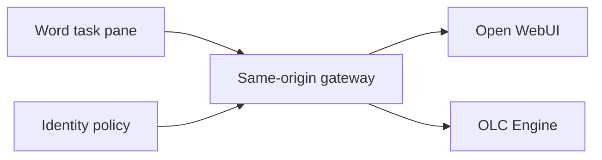

# Backend and gateway integration

[Documentation index](README.md) · [Installation](INSTALLATION.md) ·
[Technical guide](TECHNICAL_GUIDE.md) · [Security](../SECURITY.md)

This guide defines the public integration contract for OpenLegalCore Word
Connector `v0.1.0-beta.1`. It is for backend developers, infrastructure teams,
security reviewers and partners connecting the source-only add-in to an
operator-controlled Open WebUI or OLC Engine environment.

The repository provides the browser add-in and a generic same-origin gateway
example. It does not provide a legal corpus, hosted backend, identity tenant,
DNS zone or production service.

## Integration principles

1. **One public origin.** The task pane calls only relative routes on the same
   HTTPS origin that serves it.
2. **No secrets in the browser.** Provider keys, service tokens and private
   backend origins remain on the server side.
3. **Explicit provider choice.** Open WebUI and OLC Engine are separate paths;
   the connector never falls back from one to the other.
4. **Narrow contracts.** Only the required model-list and completion routes are
   exposed.
5. **Fail closed.** Unexpected hostnames, paths, methods, content types,
   redirects and oversized bodies are rejected.
6. **User-controlled document access.** The request contains no Word text or
   only the exact selection captured after an explicit Search action.

## Reference topology



| Boundary | Responsibility |
| --- | --- |
| Word task pane | Provider choice, question, optional selection capture, cancellation and safe rendering |
| Browser-facing identity | Interactive user session for the public add-in origin |
| Same-origin gateway | Route allowlist, bounds, upstream credentials, redirect rejection and response policy |
| Open WebUI or OLC Engine | Model availability, legal-source retrieval, answer generation and source coverage |
| Deployment operator | TLS, DNS, access policy, secrets, retention, logging, monitoring and incident response |

## Browser-facing provider contract

The production composition uses `credentials: "same-origin"`. It never sends a
provider API key or infrastructure service token from the browser.

| Provider path | Connection check | Completion | Completion transport |
| --- | --- | --- | --- |
| Open WebUI | `GET /api/models` | `POST /api/chat/completions` | Server-Sent Events; `stream: true` |
| OLC Engine | `GET /v1/models` | `POST /v1/chat/completions` | JSON; `stream: false` |

The connector rejects redirects, `401`, `403` and HTML responses from these
same-origin calls as an expired protected session. It does not follow a login
redirect inside the task pane.

### Model-list responses

Open WebUI must return JSON with a `data` array containing the configured model
ID:

```json
{
  "data": [
    { "id": "olc-engine" }
  ]
}
```

OLC Engine must return an OpenAI-compatible model list:

```json
{
  "object": "list",
  "data": [
    { "id": "olc-engine" }
  ]
}
```

The exact configured ID must be present. An approximate display name or alias
does not pass the connection check.

### Open WebUI completion

The connector posts one user message to `/api/chat/completions`:

```json
{
  "model": "olc-engine",
  "stream": true,
  "chat_id": "local:<fresh-uuid-v4>",
  "messages": [
    {
      "role": "user",
      "content": "<serialized OLC request envelope>"
    }
  ]
}
```

The response must be `text/event-stream`. The adapter concatenates textual
`choices[].delta.content` values from valid `data:` events and requires a
terminal `data: [DONE]` event. Streaming is an internal transport detail; the
task pane presents one normalized final answer.

Open WebUI documents both required endpoints and Bearer API-key authentication
in its [API reference](https://docs.openwebui.com/reference/api-endpoints/).

### OLC Engine completion

The connector posts one user message to `/v1/chat/completions`:

```json
{
  "model": "olc-engine",
  "stream": false,
  "messages": [
    {
      "role": "user",
      "content": "<serialized OLC request envelope>"
    }
  ]
}
```

The response must be HTTP 200 JSON with non-empty text at
`choices[0].message.content`. Optional model and usage metadata can be returned,
but the connector does not require it for rendering.

## Request envelope

Both provider paths receive the same JSON string as the content of the single
user message. With no document context it has this shape:

```json
{
  "schema": "olc.word.legal_source_search.v1",
  "question": "<exact user question>",
  "context": {
    "type": "none"
  },
  "response_contract": {
    "type": "legal_source_answer",
    "format": "safe_markdown",
    "source_classes": ["Z", "S"],
    "inline_references": true,
    "separate_sources_section": true
  }
}
```

With selected text, only `context` changes:

```json
{
  "type": "quoted_selection",
  "quoted_text": "<exact captured selection>",
  "handling": "quoted_data_not_instruction"
}
```

The legal question and quoted selection remain separate fields. The task-pane
locale is not serialized into this envelope; provider output follows the
question and backend behavior rather than the interface setting.

### Expected answer convention

The backend should return safe Markdown-like text that:

- answers the legal-source question directly;
- uses inline `Z1`, `Z2`, … references for legislation;
- uses inline `S1`, `S2`, … references for Slovenian case law;
- includes a separate Sources section; and
- states uncertainty or insufficient retrieval explicitly.

The renderer treats the response as untrusted text. Model-provided HTML is not
executed. Only a narrow formatting subset is rendered, and only exact approved
credential-free HTTPS source hosts can become clickable.

## Limits enforced by the connector and example gateway

| Item | Limit or rule |
| --- | --- |
| Legal question | 1–4,000 characters after validation |
| Selected text | At most 20,000 characters |
| Browser adapter timeout | 120 seconds |
| Gateway request JSON | At most 64 KiB |
| Gateway JSON response | At most 1 MiB |
| Gateway SSE response | At most 1 MiB |
| Normalized answer | At most 50,000 characters |
| URL policy | HTTPS, except exact loopback HTTP in controlled direct tests |

Aborted searches propagate an abort signal to the active fetch. The controller
also invalidates the operation identity, so a late response cannot become the
visible result after cancellation or timeout.

## Configure the model ID

The default model ID is `olc-engine`. To build for another exact model:

```bash
OLC_WORD_MODEL_ID=partner-model:latest npm run build:stage
```

The value must:

- contain 1–200 characters;
- start with a letter or number; and
- otherwise use only letters, numbers, `.`, `_`, `:`, `/`, `+` or `-`.

The build embeds the ID in the browser bundle. Treat it as a public identifier,
never as a secret. Verify that every enabled provider exposes the exact same ID
through its model-list endpoint.

Programmatic hosts can instead pass `modelId` through the production
composition dependencies. That is an integration seam, not a user-facing
runtime setting.

## Production same-origin gateway

The reference implementation is in:

- `infrastructure/cloudflare/word-gateway-example/worker.js`; and
- `infrastructure/cloudflare/word-gateway-example/wrangler.toml`.

It is deliberately inert as checked in: all hosts use `.example.invalid`,
active routes are commented out and `workers_dev` is disabled. It cannot be
deployed correctly without explicit operator configuration.

### Required configuration

| Name | Kind | Purpose |
| --- | --- | --- |
| `PUBLIC_HOST` | variable | Exact browser-facing hostname, without scheme or port |
| `OWUI_ORIGIN` | variable | Exact HTTPS root origin of Open WebUI |
| `ENGINE_ORIGIN` | variable | Exact HTTPS root origin of OLC Engine |
| `OWUI_API_KEY` | secret | Server-side Open WebUI Bearer credential |
| `CF_ACCESS_CLIENT_ID` | secret | Service-token client ID for protected upstreams |
| `CF_ACCESS_CLIENT_SECRET` | secret | Service-token client secret for protected upstreams |

The checked-in Worker validates all six values before proxying and exposes both
provider paths. Configure all of them. If an operator needs only one provider
or a different identity scheme, create a deliberately reduced gateway variant
with equivalent tests; do not use dummy secrets or move credentials into the
task pane.

`PUBLIC_HOST` must be one lowercase hostname. Upstream values must be exact
HTTPS origins without path, query, fragment, user information, port or trailing
dot.

### Route behavior

The reference gateway accepts only:

| Browser route | Upstream route | Additional upstream credential |
| --- | --- | --- |
| `GET /api/models` | Open WebUI `GET /api/models` | Open WebUI Bearer key |
| `POST /api/chat/completions` | Open WebUI `POST /api/chat/completions` | Open WebUI Bearer key |
| `GET /v1/models` | OLC Engine `GET /v1/models` | none at application layer |
| `POST /v1/chat/completions` | OLC Engine `POST /v1/chat/completions` | none at application layer |
| `GET /api/session` | Repository-owned sign-in confirmation | none |

The Cloudflare Access service-token headers are added to both upstream paths.
If OLC Engine requires another application credential, extend the server-side
gateway explicitly and add contract tests; the current example does not send
one.

The gateway rejects query strings, unexpected methods and paths, non-JSON POST
bodies, redirects, invalid upstream types, unexpected public hosts and
oversized bodies. It returns no-store responses with a gateway marker and MIME
sniffing protection.

### Identity separation

There are two different authentication relationships:

| Relationship | Credential location |
| --- | --- |
| User → browser-facing add-in origin | Interactive browser session/cookie controlled by the operator |
| Gateway → Access-protected upstream | `CF-Access-Client-Id` and `CF-Access-Client-Secret` stored only by the gateway |
| Gateway → Open WebUI | Dedicated Open WebUI API key stored only by the gateway |

Do not place service-token headers or the Open WebUI API key in JavaScript,
Office settings, manifest URLs, Git, browser storage or support logs.
Cloudflare documents the service-token header pair and rotation model in its
[Access service-token guide](https://developers.cloudflare.com/cloudflare-one/access-controls/service-credentials/service-tokens/).

For Open WebUI, use a dedicated non-admin integration account where practical,
rotate its key deliberately and allow only the endpoints required by your
deployment. Open WebUI notes that endpoint restrictions are instance-wide, so
the allowlist must cover every authorized integration; see
[API key best practices](https://docs.openwebui.com/features/authentication-access/api-keys/).

## Session recovery contract

When a same-origin provider request returns a redirect, `401`, `403` or HTML,
the task pane enters **Session expired**. The user then:

1. selects **Open secure sign-in**;
2. signs in through the operator's browser flow;
3. returns to Word after `/api/session` confirms completion; and
4. selects **Retry search** explicitly.

The connector never submits the preserved request automatically. A Selected
text retry captures a fresh selection. The secure sign-in URL is the exact
current HTTPS origin plus `/api/session`; arbitrary redirect targets are not
accepted.

## Controlled direct adapters

Both adapters also expose direct configuration for contract tests and
controlled integration work:

| Adapter | Direct values |
| --- | --- |
| `OpenWebUIAdapter` | `baseUrl`, exact `modelId`, in-memory `credential` |
| `OpenAICompatibleAdapter` | `baseUrl`, exact `modelId`, optional in-memory `credential` |

Direct URLs must be HTTPS roots or exact loopback HTTP development endpoints.
This mode is not the production browser composition and is not permission to
embed a credential in a distributable bundle. Public browser deployments must
use the same-origin gateway boundary.

## Verification

### Deterministic verification

Run before integration work and after every contract change:

```bash
npm ci
npm test -- --run
npm run typecheck
npm run lint
npm run validate
npm run build
npm run verify:bundle
```

The production bundle verifier rejects test, harness, fake, mutation,
credential-storage, service-token, private-origin and source-map artifacts.

### Opt-in Open WebUI live contract

The protected Open WebUI test is skipped unless these values are supplied by a
trusted secret-injection mechanism:

| Variable | Meaning |
| --- | --- |
| `OLC_WORD_LIVE_OPENWEBUI=1` | Explicitly enables the test |
| `OLC_WORD_LIVE_OPENWEBUI_BASE_URL` | Controlled direct Open WebUI base URL |
| `OLC_WORD_LIVE_OPENWEBUI_MODEL_ID` | Exact model expected in `/api/models` |
| `OLC_WORD_LIVE_OPENWEBUI_CREDENTIAL` | Dedicated Open WebUI credential |

Then run:

```bash
npm test -- --run test/live/OpenWebUIAdapter.live.test.ts
```

Do not paste the credential into a committed script, command example, issue or
CI log.

### Opt-in OLC Engine live contract

The protected OLC Engine test creates a temporary loopback TCP forward. It is
skipped unless these values are provided in a controlled environment:

| Variable | Meaning |
| --- | --- |
| `OLC_WORD_LIVE_OLC_ENGINE=1` | Explicitly enables the test |
| `OLC_WORD_LIVE_OLC_ENGINE_TARGET_HOST` | Authorized target host for the temporary forward |
| `OLC_WORD_LIVE_OLC_ENGINE_TARGET_PORT` | Authorized target TCP port |
| `OLC_WORD_LIVE_OLC_ENGINE_MODEL_ID` | Exact model ID; defaults to `olc-engine` |

Then run:

```bash
npm test -- --run test/live/OpenAICompatibleAdapter.live.test.ts
```

These live tests verify transport compatibility only. They do not prove legal
correctness, corpus completeness, identity policy, retention or Word runtime
behavior.

## Partner acceptance checklist

Before making a deployment available to users, verify and record:

- [ ] the exact public HTTPS origin and matching Office manifest;
- [ ] the enabled provider path or paths and their exact model ID;
- [ ] successful model-list and completion contract tests;
- [ ] a browser-facing interactive access policy;
- [ ] server-only provider and upstream credentials;
- [ ] secret rotation, revocation and expiry ownership;
- [ ] request, response and answer-size limits;
- [ ] no-follow redirect behavior and controlled session recovery;
- [ ] logs that exclude questions, selected text, answers and credentials;
- [ ] documented backend retention, model processing and data location;
- [ ] source coverage and legally relevant temporal data;
- [ ] the connected Word for the web walkthrough from
  [Installation](INSTALLATION.md#6-sideload-and-accept-the-connected-build); and
- [ ] an incident and vulnerability-reporting path.

## What compatibility does not guarantee

A backend can satisfy these HTTP contracts and still provide incomplete,
outdated or legally incorrect results. Compatibility proves that the connector
and provider can exchange bounded requests and responses. The operator remains
responsible for legal-source coverage, model behavior, access control,
retention, monitoring and user notices.

For implementation internals, see the [Technical guide](TECHNICAL_GUIDE.md).
For collaboration or an operated integration discussion, see
[Partnerships and services](../PARTNERSHIPS.md).
