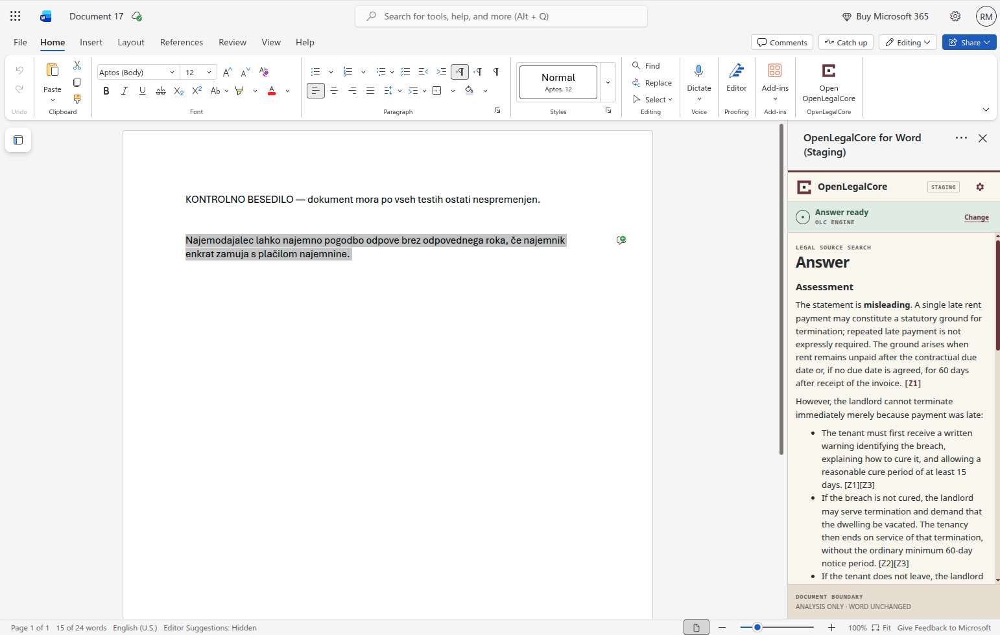
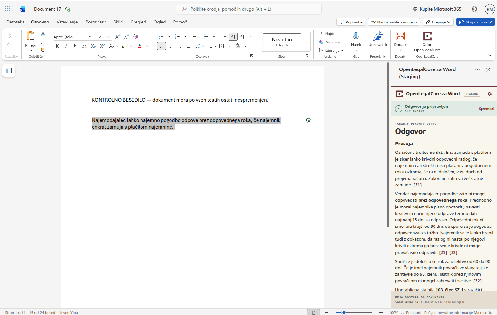

# Bilingual product gallery

[Documentation index](README.md) · [User guide](USER_GUIDE.md)

The gallery shows six representative workflow states from the source-only
`v0.1.0-beta.1` beta in English (`en-US`) and Slovenian (`sl-SI`). Select any
preview to open the original full-size image.

The images were captured in Word for the web against private staging on
4 September 2026. The visible `STAGING` label is intentional. The gallery
illustrates the interface; it does not claim public-service availability,
exhaustive retrieval, legal correctness or support beyond the documented
compatibility boundary.

## 1. No document context

Word content remains outside the request even when text is visible in the
document.

| English | Slovenian |
| --- | --- |
|  |  |

## 2. Selected text and question

The user explicitly chooses the highlighted passage and supplies a separate
legal question.

| English | Slovenian |
| --- | --- |
|  |  |

## 3. Search in progress

The analysis-only progress state keeps the document boundary visible and makes
the Cancel action available.

| English | Slovenian |
| --- | --- |
|  |  |

## 4. Answer overview

The answer is rendered as text with inline source references rather than trusted
HTML.

| English | Slovenian |
| --- | --- |
|  |  |

## 5. Sources and result actions

The result provides a Sources section together with Copy answer, Refine
question and New search actions while the document remains unchanged.

| English | Slovenian |
| --- | --- |
|  |  |

## 6. Open WebUI result

The explicitly selected Open WebUI path uses the same source-and-action
presentation as the OLC Engine path.

| English | Slovenian |
| --- | --- |
|  |  |

The English selected-text examples deliberately analyse Slovenian source text
with an English question and answer. This demonstrates that the task-pane
interface locale and provider-output language are separate.

## Evidence boundary

The screenshots document visible product states; they are not the release-gate
evidence by themselves. The accepted Word for the web walkthrough on
5 September 2026 separately verified cancellation with late-response
suppression, secure session recovery with an explicit retry, both provider
paths, both context modes and an unchanged Word document. See
[Compatibility and limitations](COMPATIBILITY_AND_LIMITATIONS.md) for the
current support boundary.

## Maintaining the gallery

- Keep English and Slovenian filenames aligned by number and workflow meaning.
- Keep only these twelve curated images in the versioned `v0.1` set.
- Preserve the `STAGING` label; do not present private staging as a public
  service.
- Never add credentials, private URLs, client material or other sensitive data.
- Update this gallery when the visible workflow changes materially.
