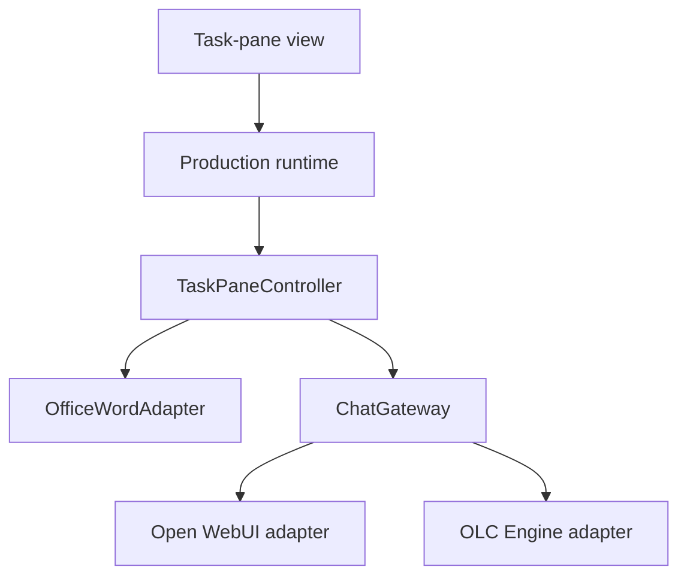

# Technical guide

[Documentation index](README.md) · [Integration guide](INTEGRATION.md) ·
[Compatibility](COMPATIBILITY_AND_LIMITATIONS.md) ·
[Troubleshooting](TROUBLESHOOTING.md)

This guide documents the implemented architecture, invariants and verification
boundaries of OpenLegalCore Word Connector `v0.1.0-beta.1`. It is intended for
developers, maintainers and security reviewers. For the operator-facing wire,
identity and deployment contract, use the
[backend and gateway integration guide](INTEGRATION.md).

The repository contains a source-only Microsoft Word task-pane add-in. It does
not contain OLC Engine, Open WebUI, a legal corpus, a hosted OpenLegalCore
service, an identity tenant or an AppSource listing.

## Design goals

The implementation is deliberately narrow:

- read no document content unless the user selects **Selected text** and starts
  a search;
- keep Word access, provider transport and rendering in separate boundaries;
- send browser requests only to same-origin routes in deployable builds;
- keep provider and infrastructure credentials out of frontend code;
- normalize both provider transports behind one semantic interface;
- render model output as untrusted text through a strict allowlist; and
- make cancellation, timeout and supersession incapable of publishing a stale
  result or changing the document.

The legal-source scope is Slovenian
[legislation](https://pisrs.si/) and
[case law](https://www.sodnapraksa.si/), as supplied by the configured backend.
Retrieval coverage and answer quality are backend-dependent.

## Runtime architecture



| Layer | Primary responsibility | Deliberate exclusion |
| --- | --- | --- |
| `TaskPaneView` / production runtime | UI state, localization, provider choice, connection check, sign-in launch and result actions | Provider credentials and direct Word proxy handling |
| `TaskPaneController` | One active operation, selection orchestration, cancellation and stale-result suppression | HTTP routes, DOM rendering and provider-specific parsing |
| `OfficeWordAdapter` | Capture and release a serializable selection snapshot | Models, prompts, HTTP and document mutation |
| `OpenWebUIAdapter` | Open WebUI model discovery, request construction and SSE parsing | Office.js and task-pane DOM |
| `OpenAICompatibleAdapter` | OLC Engine model discovery, JSON completion and bounds | Office.js and task-pane DOM |
| `safeLegalAnswer` | Parse and render the accepted presentation subset | Model-provided HTML execution |

Office proxy objects never cross the Word adapter boundary. Gateway adapters
receive plain serializable data and never receive Office proxy objects.

## Controller and document boundary

`ChatGateway` exposes two operations:

```ts
checkConnection(signal?: AbortSignal): Promise<void>
complete(request: CompletionRequest, signal?: AbortSignal): Promise<CompletionResult>
```

The internal `CompletionRequest` contains:

- the exact legal question;
- either `{ type: "none" }` or selected text as plain quoted data; and
- an internal `uiLocale` field. The production runtime currently sets that
  field to `en-US`.

The provider prompt serializer deliberately does **not** serialize `uiLocale`.
The wire envelope contains only the schema identifier, question, context and
response contract. Interface localization therefore cannot silently rewrite
the legal question or instruct the provider to translate its answer.

### No document context

When **No document context** is selected, the controller does not call
`captureSelection()`. No Word document text is read or sent.

### Selected text

When **Selected text** is selected, capture occurs only after the user starts a
search. The selection policy:

- rejects empty or whitespace-only selections;
- limits selected text to 20,000 characters;
- accepts text from the main document body or one table cell; and
- rejects contained tables, inline pictures, control characters and unsupported
  embedded structures.

The serialized context remains separate from the question:

```json
{
  "type": "quoted_selection",
  "quoted_text": "<exact captured selection>",
  "handling": "quoted_data_not_instruction"
}
```

The production Word adapter is read-only. A historical replacement canary
exists only under `test/office/` and the development Word harness. Production
composition does not import it, and bundle verification rejects its mutation
primitive.

## Provider-neutral prompt envelope

Both adapters place the same serialized envelope in one user message:

```json
{
  "schema": "olc.word.legal_source_search.v1",
  "question": "<exact user question>",
  "context": {
    "type": "none"
  },
  "response_contract": {
    "type": "legal_source_answer",
    "format": "safe_markdown",
    "source_classes": ["Z", "S"],
    "inline_references": true,
    "separate_sources_section": true
  }
}
```

`CompletionResult` returns normalized final text and optional model or usage
metadata. It contains no URL, HTTP response, SSE event, Open WebUI chat
identifier, Word object or credential.

## Provider transports

Deployable composition uses relative same-origin paths:

| Provider | Connection check | Completion | Response |
| --- | --- | --- | --- |
| Open WebUI | `GET /api/models` | `POST /api/chat/completions` with `stream: true` and a fresh `local:<UUIDv4>` chat ID | `text/event-stream` with a required completion boundary |
| OLC Engine | `GET /v1/models` | `POST /v1/chat/completions` with `stream: false` | HTTP 200 `application/json` with non-empty `choices[0].message.content` |

The exact configured model ID must appear in the selected provider's model
list. The build default is `olc-engine`. `OLC_WORD_MODEL_ID` may supply another
public, non-secret model identifier that matches the repository's validation
rule.

Open WebUI streaming is internal to its adapter. The controller and task pane
receive one final normalized answer. There is no automatic provider fallback,
cross-provider retry or requirement that the two providers return identical
wording.

The public contract and reference gateway details are specified in
[Backend and gateway integration](INTEGRATION.md).

## Network, credential and session boundary

The production runtime creates both adapters in `same-origin` mode:

- requests use `credentials: "same-origin"`;
- redirects are handled manually rather than followed inside the task pane;
- frontend code accepts neither a provider base URL nor a provider credential;
- no `Authorization`, `CF-Access-Client-ID` or
  `CF-Access-Client-Secret` header is created by browser composition; and
- credentials are not written to local storage, session storage, IndexedDB,
  Office settings or URLs.

The operator's gateway owns upstream origins and credentials. The checked-in
Cloudflare Worker is a generic reference implementation, not a hosted service.
It requires deliberate configuration and keeps Open WebUI and private-origin
credentials server-side.

In same-origin mode, a redirect, HTML login response, `401` or `403` maps to
`SESSION_EXPIRED`. The task pane opens the fixed `/api/session` sign-in path in
a separate browser context. Sign-in completion never resubmits a legal question:
the user must return to Word and explicitly choose **Retry search**.

## Cancellation, timeout and stale-result suppression

Each adapter enforces a 120-second request boundary and observes the
controller's abort signal. The controller assigns every operation an identity.
Cancel, timeout, provider change or supersession invalidates that identity, so
a later resolve or reject cannot publish or replace a result.

Cancel returns the task pane to a ready state while preserving the form state.
Neither cancellation nor a late response invokes a Word mutation path.

## Safe legal-answer rendering

Provider output is treated as untrusted text. The renderer builds DOM nodes
with `createElement` and `textContent`; it does not insert model-provided HTML.

The accepted presentation subset is:

- headings rendered at a fixed safe level;
- ordered and unordered lists;
- bold text;
- inline `[Z<number>]` legislation and `[S<number>]` case-law references;
- reference definitions such as
  `[Z1]: <https://pisrs.si/...>`; and
- Markdown links that pass the URL policy.

A link becomes clickable only when it uses HTTPS, contains no credentials or
explicit port, and has one of these exact hostnames:

- `pisrs.si`
- `www.pisrs.si`
- `sodnapraksa.si`
- `www.sodnapraksa.si`

Executable schemes, HTTP, malformed or lookalike hosts, nonstandard ports,
credentials, control characters and model-provided HTML remain inert text.
Accepted links open in a new tab with `rel="noopener noreferrer"`.

## Localization boundary

The task pane includes complete `en-US` and `sl-SI` message catalogs. A new
runtime resolves Office `displayLanguage`, then `navigator.language`, then
`en-US`. Changing language in Settings affects only the current task-pane
instance and is not persisted.

The task-pane locale controls connector-owned UI text. It does not translate
provider answers, citations, source content, URLs or clipboard output. The
`/api/session` landing page independently chooses English or Slovenian from
`Accept-Language`. Cloudflare Access and other external identity pages are not
repository-owned.

## Manifests and permissions

The Office manifest version is `1.0.0.3`; it is a manifest deployment counter,
not the package version `0.1.0-beta.1`. Office icons remain independently
versioned at `1.0.0.2`.

| Manifest | Add-in identity | Permission | Purpose |
| --- | --- | --- | --- |
| `manifest.xml` | `7eb3a8cf-4fa9-47f2-a408-afe5f6c59515` | `ReadWriteDocument` | Local-development alias |
| `manifests/manifest.dev.xml` | same development identity | `ReadWriteDocument` | Local development and mutation-safety harness |
| `manifests/manifest.stage.xml` | `d913b3fe-90e7-4bc9-86d2-d391ea0a7fd1` | `ReadDocument` | Inert example staging identity; placeholder host must be replaced |
| `manifests/manifest.prod.xml` | `d8008df4-dd56-4150-9ed5-69a59ccd4889` | `ReadDocument` | Reserved production identity; no hosted service is supplied |

All manifests require Word JavaScript API requirement set `WordApi 1.3`.
Development manifests retain write permission only for the isolated historical
mutation harness. The deployable legal-source workflow neither exposes nor
calls that primitive.

## Build and verification

Install the locked dependency tree:

```bash
npm ci
```

Run deterministic verification:

```bash
npm test -- --run
npm run typecheck
npm run lint
npm run validate
npm run validate:dev
npm run validate:stage
npm run validate:prod
```

Build targets are explicit:

| Command | Output | Purpose |
| --- | --- | --- |
| `npm run build:harness` | `dist/harness/` | Browser-only UI and state gallery |
| `npm run build:word-harness` | `dist/word-harness/` | Development Word acceptance harness |
| `npm run build:dev` | `dist/dev/` | Local-development add-in |
| `npm run build:stage` | `dist/stage/` | Deployable staging-shaped artifact; replace placeholder manifest URLs before use |
| `npm run build` | `dist/prod/` | Production-shaped artifact; hosting is not included |
| `npm run verify:bundle` | verifies `dist/prod/` | Production identity and isolation checks |

Deployable builds contain no source maps or `sourceMappingURL` reference.
Production bundle verification rejects test or harness imports, fake
implementations, development controls, browser credential storage,
service-token headers and private-origin markers.

`npm start` is a local developer workflow. The root manifest loads
`https://localhost:3002`, while the stock development server does not provide
the same-origin provider routes. It can prove Office loading and UI composition
without proving live legal-source search. See
[Installation and deployment](INSTALLATION.md) for the three supported
evaluation paths.

## Evidence boundary

Deterministic tests cover controller state, Word access, selection policy, both
adapters with fake transports, prompt serialization, SSE and JSON parsing,
error mapping, safe rendering, production composition, gateway behavior,
manifest policy and bundle isolation.

Opt-in live suites validate exact configured backends. They are skipped in
ordinary offline tests and CI. A test harness, screenshot or successful build
is not a substitute for Word runtime acceptance.

For the `v0.1.0-beta.1` candidate, owner-executed Word for the web acceptance
verified:

- both provider paths and both context modes;
- English and Slovenian task-pane states;
- answer, source and result actions;
- cancellation followed by more than the delayed-response window, with no late
  result;
- expired-session recovery through secure sign-in and an explicit Retry search;
  and
- an unchanged Word document throughout.

Word for Windows and Word for Mac remain untested, and this release makes no
support claim for them. See
[Compatibility and limitations](COMPATIBILITY_AND_LIMITATIONS.md) for the
complete evidence matrix.

## Self-hosting responsibilities

A deployment operator is responsible for:

- a compatible Open WebUI and/or OLC Engine target and exact model;
- legal-source ingestion, indexing, temporal coverage and answer behavior;
- HTTPS, DNS, certificates, browser identity and same-origin routing;
- server-side provider and private-origin credentials;
- restrictive CORS and content-security policy;
- logging, retention, privacy notices, backups and incident response;
- legal and regulatory compliance; and
- client-specific sideloading or distribution and acceptance testing.

Do not put provider keys or service tokens into frontend code, and do not enable
wildcard CORS as a deployment shortcut.

A passing source build does not guarantee backend availability, retrieval
coverage, legal correctness, supported Word clients or production readiness.

## Further reading

- [Installation and deployment](INSTALLATION.md)
- [Backend and gateway integration](INTEGRATION.md)
- [Compatibility and limitations](COMPATIBILITY_AND_LIMITATIONS.md)
- [Troubleshooting](TROUBLESHOOTING.md)
- [Security](../SECURITY.md)
- [Privacy](../PRIVACY.md)
- [Release policy](RELEASE_POLICY.md)
