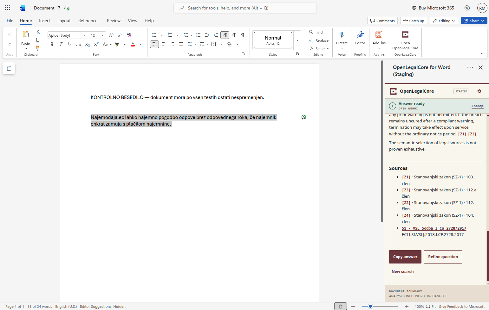
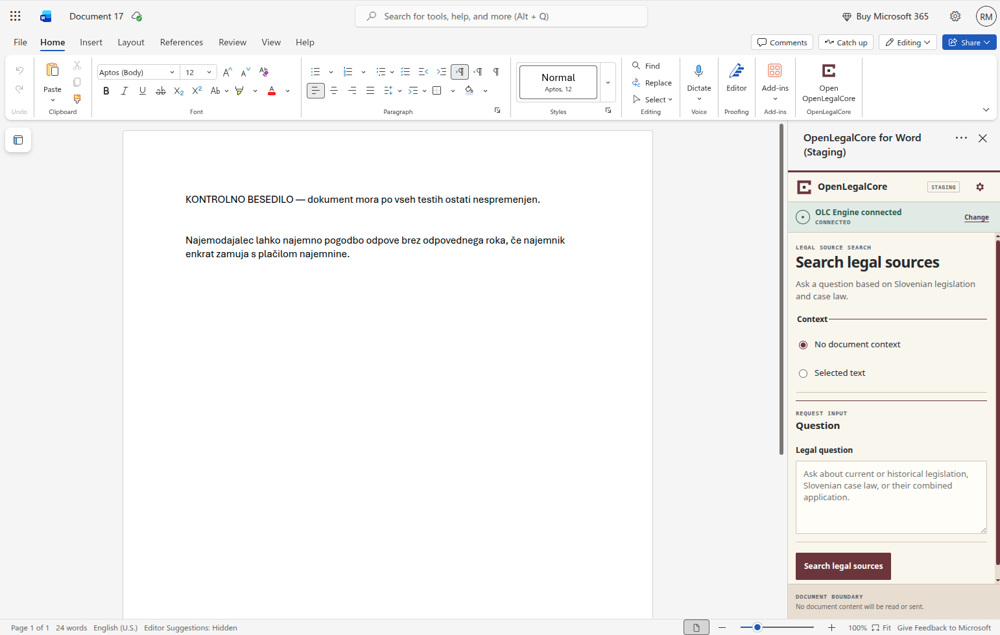
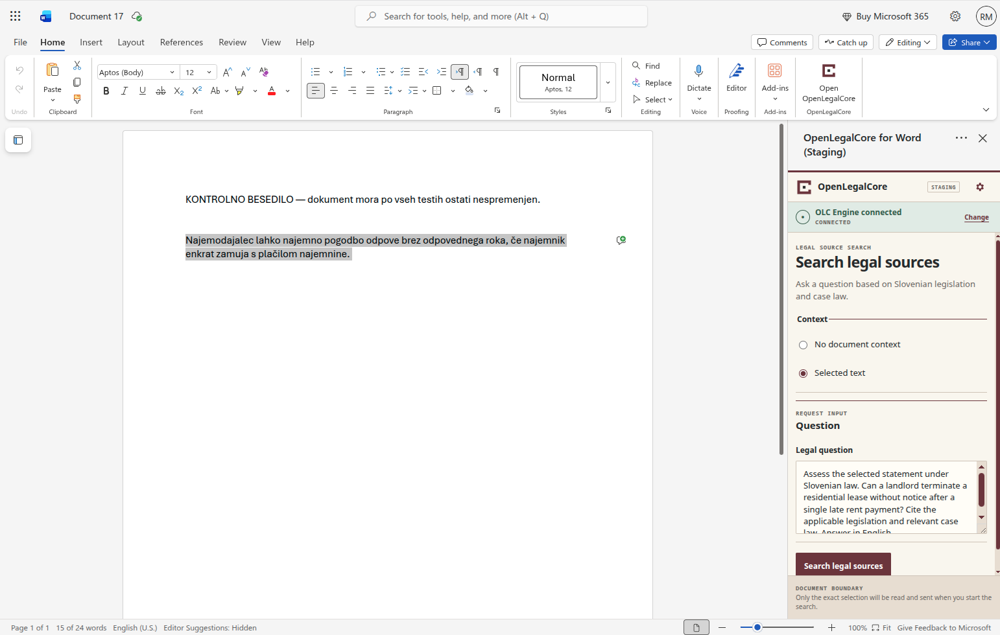
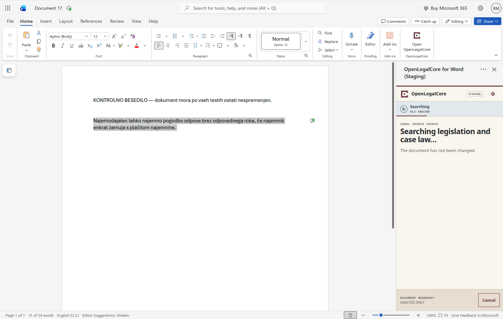

# User guide

[Slovenščina](USER_GUIDE.sl-SI.md) · [Product gallery](SCREENSHOTS.md) ·
[Installation](INSTALLATION.md) · [Troubleshooting](TROUBLESHOOTING.md)

OpenLegalCore Word Connector brings a focused Slovenian legal-source search
workflow into a Microsoft Word task pane. You choose the service, decide
whether any selected Word text may be used, ask a legal question, and review an
answer with sources. The beta does not change the Word document.

> [!IMPORTANT]
> The connector supports research; it is not an authoritative legal source and
> does not replace professional legal judgment. Verify every relevant law,
> historical version and court decision before relying on an answer.

## What you need

You need:

- Word for the web with the add-in installed or sideloaded;
- access to an operator-configured Open WebUI or OLC Engine path;
- any browser sign-in required by that operator; and
- permission to submit the question and any selected text to that deployment.

This source repository does not include an AppSource installation, hosted
service, legal database or backend access. Developers and operators should
start with [Installation and deployment](INSTALLATION.md).

## The workflow at a glance

1. Open **Open OpenLegalCore** from the Word Home ribbon.
2. Choose **Use Open WebUI** or **Use OLC Engine**.
3. Choose **No document context** or **Selected text**.
4. Enter a legal question and select **Search legal sources**.
5. Verify the answer against its cited sources.
6. Copy the answer, refine the question or start a new search.

The connector supports English (`en-US`) and Slovenian (`sl-SI`). A fresh task
pane uses the supported Office display language, then the browser language,
then English. You can change the task-pane language in **Settings** for the
current runtime; the choice is not saved.

The interface language and answer language are separate. Ask in Slovenian for
a Slovenian answer or in English for an English answer. The connector does not
translate model output, citations, source text, URLs or copied content.

## 1. Open the task pane

1. Open the document you intend to use.
2. On the Word **Home** ribbon, select **Open OpenLegalCore**.
3. Wait for the task pane to report that the Word host is ready.
4. If the pane or ribbon command is missing, see
   [Troubleshooting](TROUBLESHOOTING.md#the-add-in-or-task-pane-does-not-open).

The screenshots in this guide were captured against private staging. The
visible `STAGING` label is intentional and does not imply that a public service
is included. Select a preview to open its full-size image.

## 2. Choose the service explicitly

Select one provider path:

| Choice | What the connector uses |
| --- | --- |
| **Use Open WebUI** | The configured Open WebUI compatibility endpoint |
| **Use OLC Engine** | The configured OpenAI-compatible OLC Engine endpoint |

The connector checks the selected service before showing the search form. It
does not switch providers automatically, retry against the other provider or
share one provider's credentials with the other.

  

Both provider paths use the same review and document-safety workflow.

If the connection check fails, confirm that you selected the intended service
and ask the deployment operator to verify its route, model and access policy.

## 3. Choose the document context

The context choice controls whether the connector reads any Word text.

### No document context

This is the default. The connector does not call the Word selection API and
sends no document content. Only the legal question is sent.

  

Use this mode whenever the question stands on its own, for example:

> On 18 June 2021, what did Article 112 of the Housing Act (SZ-1) provide about
> the notice period and the court-ordered period to vacate? Identify the
> historical version used and cite the source.

### Selected text

Use this mode when the question concerns a precise passage in the document:

1. Highlight only the relevant text in Word.
2. Choose **Selected text**.
3. Enter the legal question.
4. Select **Search legal sources**.

The connector captures the exact current selection only when the search starts.
It sends that text as quoted data in a field separate from the question. It
does not add the rest of the document, surrounding paragraphs, document name,
file path or document metadata.

  

The search stops before contacting a provider if the selection is:

- empty or whitespace only;
- longer than 20,000 characters;
- spread across unsupported embedded structures; or
- a table selection other than ordinary text within one cell.

If Word selection changes after a search starts, the active request still uses
the snapshot captured at the start. A later explicit retry captures the
then-current selection again.

## 4. Ask a precise legal-source question

Include the jurisdiction, issue, legally relevant date and source type when
they matter. Ask for citations and invite the backend to state when evidence is
insufficient. A question can contain up to 4,000 characters.

### Legislation

> Explain the conditions for ordinary termination of a residential lease under
> SZ-1. Cite the relevant provisions and verify the currently applicable text.

### Slovenian case law

> Find Slovenian case law on terminating a residential lease because rent was
> paid late. Provide court names, case numbers and the core reasoning. If no
> reliable results are available, say so explicitly.

### Legislation and case law together

> Explain the statutory conditions for termination due to unpaid rent and
> examine how Slovenian courts interpret them. Separate legislation from case
> law.

### Historical law

> What was the wording of Article 112 of SZ-1 on 18 June 2021? Identify the
> historical version, later amendments and the source link.

Historical retrieval depends on the versions indexed by the selected backend.
The connector cannot guarantee complete temporal coverage.

## 5. Start or cancel the search

Select **Search legal sources** once. During an active request, the task pane
shows **Searching legislation and case law…** and makes **Cancel** available.

  

Selecting **Cancel** aborts the active request and returns the pane to a safe
state. A response arriving later cannot replace that state or appear as a
result. Cancellation, timeout and late responses leave the document unchanged.

## 6. Read the answer and sources

The answer renderer allows only a narrow formatting subset: headings, lists,
bold text, inline `Z*` and `S*` references, and approved HTTPS source links.
Raw model HTML is never executed.

- `Z1`, `Z2`, and similar references identify legislation sources.
- `S1`, `S2`, and similar references identify Slovenian case-law sources.

When the backend follows the response contract, the task pane presents a
separate **Sources** section.

  

Only credential-free HTTPS links on the connector's exact approved PISRS and
Slovenian case-law hosts become clickable. Malformed, unsafe, non-HTTPS,
lookalike or unapproved links remain text.

## 7. Verify before relying on a result

For every material proposition:

1. Open the cited authoritative source.
2. Confirm the act, article, court, case number and date.
3. Confirm that the source supports the proposition in the answer.
4. Check the version in force at the legally relevant time.
5. Review amendments, transitional provisions, later decisions and the factual
   or procedural context.
6. Apply independent professional judgment.

Semantic retrieval is not proven exhaustive. A missing result does not prove
that no relevant provision, version or decision exists. Coverage and answer
quality depend on the backend, model and indexed data.

## 8. Choose the next action

### Copy answer

Copies the answer to the system clipboard when the environment permits it. It
does not insert content into Word or change the document.

### Refine question

Returns to the search form with the current question and context mode available
for revision. Edit the question, check the context and start a new explicit
search.

### New search

Opens a clean search form, clears the question and returns the context mode to
**No document context**.

The beta has no Apply, rewrite, regenerate, redlining, tracked-changes or
document-editing action.

## 9. Recover from an expired session

If a protected browser session expires, the connector shows **Session
expired** instead of rendering a redirect or login page as a legal answer.

1. Select **Open secure sign-in**.
2. Complete the operator's sign-in in the newly opened browser tab.
3. Wait for the confirmation that sign-in is complete, then close that tab.
4. Return to Word.
5. Select **Retry search** explicitly.

The connector preserves the question, selected provider and context mode for
recovery. It never retries automatically and never falls back to the other
provider. In **Selected text** mode, Retry search captures the then-current
selection before sending the new request.

The repository controls only its post-login confirmation page. The external
identity-provider or access page belongs to the deployment operator.

## Errors and safe failure

Connection failure, missing model, unavailable service, rate limit, timeout,
invalid or empty response, unsupported selection and clipboard failure do not
change the Word document.

When an error appears:

1. read the controlled message;
2. confirm the selected provider and document context;
3. correct the question or selection if indicated; and
4. retry only through an explicit user action.

Never work around a failure by placing provider credentials in frontend code,
disabling browser security controls or silently switching providers. See
[Troubleshooting](TROUBLESHOOTING.md).

## Privacy and confidentiality

Use **No document context** whenever document text is unnecessary. With
**Selected text**, submit the smallest relevant passage and confirm that you
are permitted to send it to the selected deployment.

The frontend does not persist provider credentials, questions, selections or
answers. Backend retention, logging, model processing and data location depend
on the operator. Read the [privacy statement](../PRIVACY.md) before using
personal, privileged or confidential material.

Do not place client documents, selected text, legal answers, credentials,
cookies or private host details in a public issue or support request.

## Verified scope and limitations

The accepted Word for the web walkthrough on 5 September 2026 covered both
provider paths, both context modes, answer and source rendering, result
actions, cancellation with late-response suppression, session recovery through
secure sign-in and explicit retry, and an unchanged document.

Current boundaries:

- Word for the web is verified. Word for Windows and Mac are untested and have
  no support claim.
- The repository does not include a hosted service, backend, legal database or
  AppSource distribution.
- Whole-document and multi-document context are not included.
- Document mutation, drafting, redlining and tracked changes are not included.
- Broader EU sources, literature and internal firm sources are roadmap items.
- The connector does not guarantee backend coverage or legal correctness.

See [Compatibility and limitations](COMPATIBILITY_AND_LIMITATIONS.md) for the
evidence matrix and [Product gallery](SCREENSHOTS.md) for all bilingual states.
