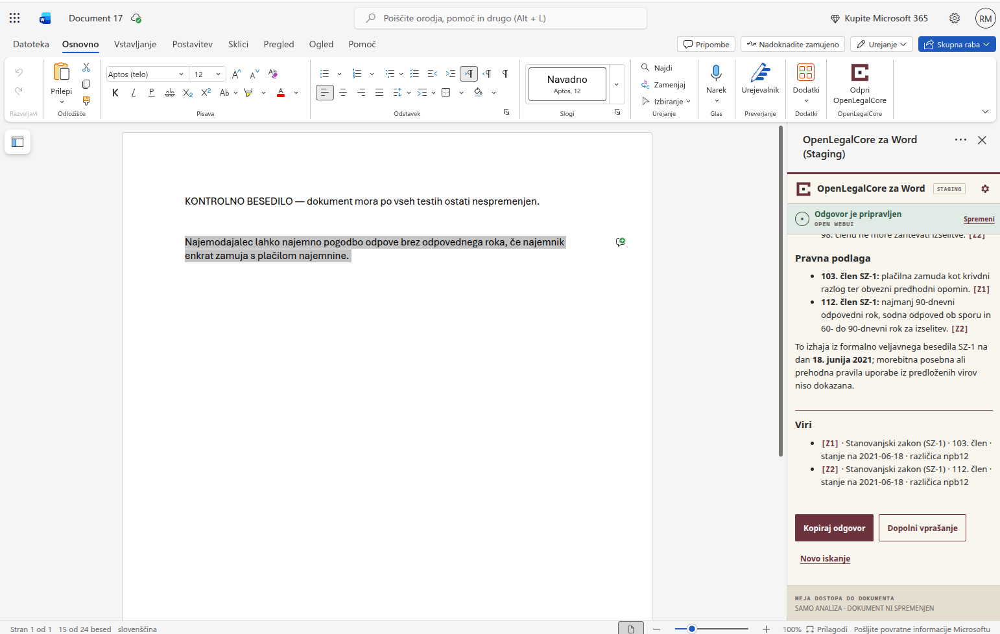
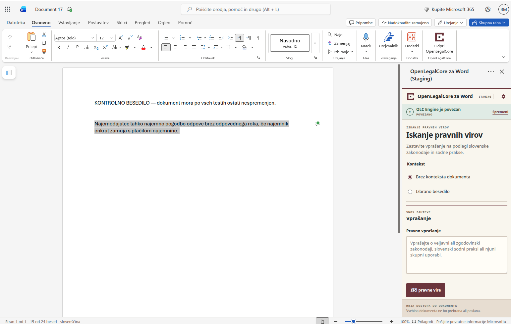
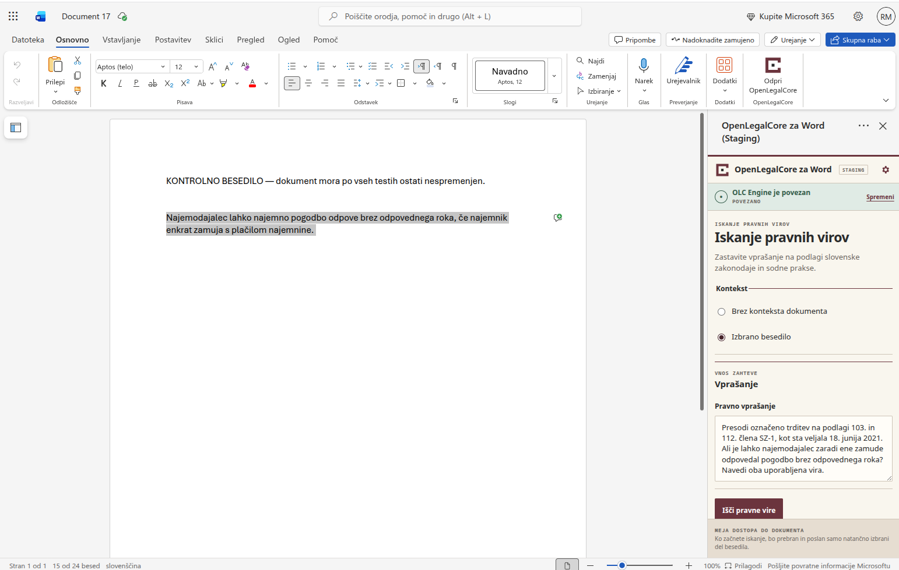
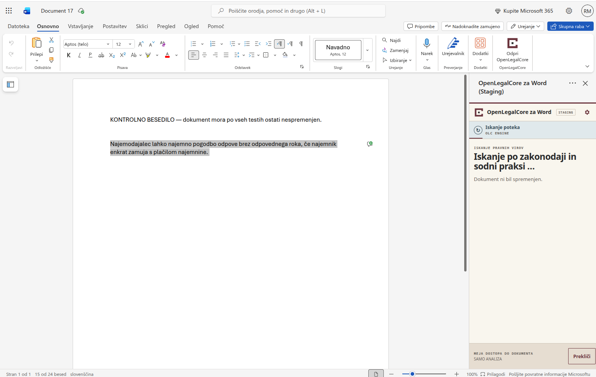
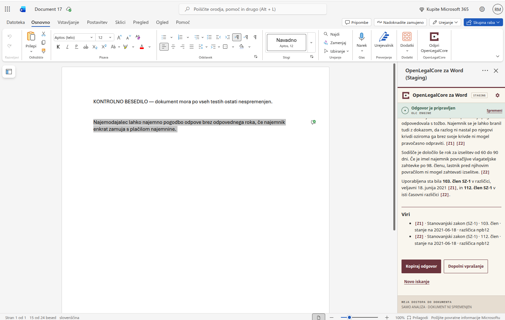

# Uporabniški priročnik

[English](USER_GUIDE.md) · [Galerija izdelka](SCREENSHOTS.md) ·
[Namestitev](INSTALLATION.md) · [Odpravljanje težav](TROUBLESHOOTING.md)

OpenLegalCore Word Connector v podokno Microsoft Worda prinaša osredotočen
postopek iskanja po slovenskih pravnih virih. Izberete storitev, odločite se,
ali se sme uporabiti izbrano besedilo iz Worda, zastavite pravno vprašanje ter
pregledate odgovor in vire. Beta različica Wordovega dokumenta ne spreminja.

> [!IMPORTANT]
> Komponenta je namenjena podpori pri raziskovanju. Ni avtoritativen pravni vir
> in ne nadomešča strokovne pravne presoje. Pred uporabo odgovora preverite vsak
> pomemben predpis, zgodovinsko različico in sodno odločbo.

## Kaj potrebujete

Potrebujete:

- Word za splet z nameščenim ali stransko naloženim dodatkom;
- dostop do poti Open WebUI ali OLC Engine, ki jo je nastavil upravljavec;
- morebitno prijavo v brskalniku, ki jo zahteva upravljavec; in
- dovoljenje za pošiljanje vprašanja ter morebitnega izbranega besedila v to
  okolje.

Ta izvorni repozitorij ne vsebuje namestitve iz AppSource, gostovane storitve,
pravne zbirke ali dostopa do zaledja. Razvijalci in upravljavci naj začnejo z
dokumentom [Installation and deployment](INSTALLATION.md).

## Postopek na kratko

1. Na Wordovem traku **Osnovno** odprite **Open OpenLegalCore**.
2. Izberite **Uporabi Open WebUI** ali **Uporabi OLC Engine**.
3. Izberite **Brez konteksta dokumenta** ali **Izbrano besedilo**.
4. Vnesite pravno vprašanje in izberite **Išči pravne vire**.
5. Odgovor preverite v navedenih virih.
6. Odgovor kopirajte, vprašanje dopolnite ali začnite novo iskanje.

Komponenta podpira angleščino (`en-US`) in slovenščino (`sl-SI`). Ob svežem
zagonu najprej uporabi podprt prikazni jezik Officea, nato jezik brskalnika in
nazadnje angleščino. Jezik podokna lahko za trenutno izvajanje spremenite v
**Nastavitvah**; izbira se ne shrani.

Jezik vmesnika in jezik odgovora nista ista nastavitev. Za slovenski odgovor
zastavite vprašanje v slovenščini, za angleškega pa v angleščini. Komponenta ne
prevaja odgovora modela, citatov, besedila virov, spletnih naslovov ali kopirane
vsebine.

## 1. Odprite podokno

1. Odprite dokument, ki ga želite uporabiti.
2. Na Wordovem traku **Osnovno** izberite **Open OpenLegalCore**.
3. Počakajte, da podokno potrdi pripravljenost Worda.
4. Če podokna ali ukaza na traku ni, glejte
   [Odpravljanje težav](TROUBLESHOOTING.md#the-add-in-or-task-pane-does-not-open).

Posnetki v tem priročniku so bili narejeni v zasebnem staging okolju. Vidna
oznaka `STAGING` je namerna in ne pomeni, da repozitorij vključuje javno
storitev. S klikom na predogled odprete sliko v polni velikosti.

## 2. Izrecno izberite storitev

Izberite eno od poti:

| Izbira | Kaj uporabi komponenta |
| --- | --- |
| **Uporabi Open WebUI** | Nastavljeno združljivo končno točko Open WebUI |
| **Uporabi OLC Engine** | Nastavljeno končno točko OLC Engine, združljivo z OpenAI |

Komponenta pred prikazom iskalnega obrazca preveri izbrano storitev. Ponudnika
ne zamenja samodejno, ob napaki ne poskusi druge poti in med ponudnikoma ne deli
poverilnic.

  

Obe poti ponudnikov uporabljata isti postopek pregleda in varovanja dokumenta.

Če preverjanje povezave ne uspe, potrdite, da ste izbrali pravo storitev, in
upravljavca okolja prosite, naj preveri pot, model in pravila dostopa.

## 3. Izberite kontekst dokumenta

Izbira konteksta določa, ali komponenta prebere katero koli besedilo iz Worda.

### Brez konteksta dokumenta

To je privzeta možnost. Komponenta ne pokliče Wordovega vmesnika za izbor in ne
pošlje nobene vsebine dokumenta. Pošlje samo pravno vprašanje.

  

To možnost uporabite vedno, ko je vprašanje samostojno, na primer:

> Na dan 18. junija 2021 pojasni 112. člen Stanovanjskega zakona (SZ-1).
> Kolikšen je bil odpovedni rok in kakšen rok je moralo sodišče določiti za
> izselitev? Navedi uporabljeno zgodovinsko različico in citiraj vir.

### Izbrano besedilo

To možnost uporabite, ko se vprašanje nanaša na natančno določen odlomek:

1. V Wordu označite samo relevantno besedilo.
2. Izberite **Izbrano besedilo**.
3. Vnesite pravno vprašanje.
4. Izberite **Išči pravne vire**.

Komponenta zajame natančen trenutni izbor šele ob začetku iskanja. Besedilo
pošlje kot citirane podatke v polju, ki je ločeno od vprašanja. Ne doda
preostanka dokumenta, okoliških odstavkov, imena dokumenta, poti do datoteke ali
metapodatkov dokumenta.

  

Iskanje se ustavi še pred klicem ponudnika, če je izbor:

- prazen ali vsebuje samo presledke;
- daljši od 20.000 znakov;
- razporejen čez nepodprte vdelane strukture; ali
- izbor tabele, ki ni navadno besedilo znotraj ene celice.

Če se izbor v Wordu po začetku iskanja spremeni, aktivna zahteva še vedno
uporablja posnetek, zajet ob začetku. Poznejši izrecni ponovni poskus znova
zajame takratni izbor.

## 4. Zastavite natančno pravno vprašanje

Kadar je pomembno, navedite jurisdikcijo, pravno vprašanje, pravno relevanten
datum in želeno vrsto vira. Zahtevajte navedbo virov in naj zaledje jasno pove,
kadar nima dovolj zanesljivih podatkov. Vprašanje lahko vsebuje do 4.000
znakov.

### Zakonodaja

> Pojasni pogoje za redno odpoved stanovanjske najemne pogodbe po SZ-1. Navedi
> relevantne člene in preveri trenutno veljavno besedilo.

### Slovenska sodna praksa

> Poišči slovensko sodno prakso o odpovedi stanovanjske najemne pogodbe zaradi
> zamude s plačilom najemnine. Navedi sodišča, opravilne številke in bistvene
> razloge. Če ni zanesljivih zadetkov, to jasno povej.

### Zakonodaja in sodna praksa skupaj

> Pojasni zakonske pogoje za odpoved zaradi neplačila najemnine in preveri, kako
> jih razlaga slovenska sodna praksa. Loči zakonodajne in sodne vire.

### Zgodovinsko stanje prava

> Kakšno je bilo besedilo 112. člena SZ-1 na dan 18. junija 2021? Navedi
> uporabljeno zgodovinsko različico, poznejše spremembe in povezavo do vira.

Zgodovinsko iskanje je odvisno od različic, ki jih je indeksiralo izbrano
zaledje. Komponenta ne more jamčiti popolne časovne pokritosti.

## 5. Začnite ali prekličite iskanje

Enkrat izberite **Išči pravne vire**. Med aktivno zahtevo podokno prikazuje
**Iskanje po zakonodaji in sodni praksi …** in ponudi **Prekliči**.

  

Z izbiro **Prekliči** prekinete aktivno zahtevo in podokno vrnete v varno
stanje. Odgovor, ki bi prispel pozneje, tega stanja ne more nadomestiti in se ne
more prikazati kot rezultat. Preklic, časovna omejitev in pozen odgovor pustijo
dokument nespremenjen.

## 6. Preberite odgovor in vire

Prikaz odgovora dovoljuje le ozek nabor oblikovanja: naslove, sezname, krepko
besedilo, sklice `Z*` in `S*` v besedilu ter odobrene povezave HTTPS. Surovi HTML
modela se nikoli ne izvede.

- `Z1`, `Z2` in podobne oznake označujejo zakonodajne vire.
- `S1`, `S2` in podobne oznake označujejo vire slovenske sodne prakse.

Ko zaledje spoštuje pogodbo odgovora, podokno prikaže ločen razdelek **Viri**.

  

Klikljive postanejo samo povezave HTTPS brez poverilnic na natančno odobrene
gostitelje PISRS in slovenske sodne prakse. Neveljavne, nevarne, nešifrirane,
zavajajoče ali neodobrene povezave ostanejo navadno besedilo.

## 7. Rezultat preverite, preden se nanj zanesete

Za vsako pomembno trditev:

1. Odprite citirani avtoritativni vir.
2. Preverite predpis, člen, sodišče, opravilno številko in datum.
3. Preverite, ali vir res podpira trditev v odgovoru.
4. Preverite različico, ki je veljala v pravno relevantnem času.
5. Preglejte spremembe, prehodne določbe, poznejše odločbe ter dejanski in
   procesni kontekst.
6. Uporabite samostojno strokovno presojo.

Semantično iskanje ni dokazano izčrpno. Odsotnost zadetka ne dokazuje, da
relevantna določba, različica ali odločba ne obstaja. Pokritost in kakovost
odgovora sta odvisni od zaledja, modela in indeksiranih podatkov.

## 8. Izberite naslednje dejanje

### Kopiraj odgovor

Odgovor kopira v sistemsko odložišče, kadar okolje to dovoljuje. Vsebine ne
vstavi v Word in dokumenta ne spremeni.

### Dopolni vprašanje

Vrne se na iskalni obrazec, kjer sta trenutno vprašanje in način konteksta na
voljo za spremembo. Uredite vprašanje, preverite kontekst in začnite novo
izrecno iskanje.

### Novo iskanje

Odpre prazen iskalni obrazec, počisti vprašanje in način konteksta vrne na
**Brez konteksta dokumenta**.

Beta različica nima dejanj za uporabo ali ponovno ustvarjanje odgovora,
prepisovanje, označevanje ali sledenje spremembam in urejanje dokumenta.

## 9. Obnovite poteklo sejo

Če poteče zaščitena seja v brskalniku, komponenta prikaže **Seja je potekla**,
namesto da bi preusmeritev ali prijavno stran prikazala kot pravni odgovor.

1. Izberite **Odpri varno prijavo**.
2. V novem zavihku brskalnika dokončajte prijavo upravljavca.
3. Počakajte na potrdilo, da je prijava končana, nato zavihek zaprite.
4. Vrnite se v Word.
5. Izrecno izberite **Ponovi iskanje**.

Komponenta za obnovo ohrani vprašanje, izbranega ponudnika in način konteksta.
Nikoli ne poskusi samodejno in ne preklopi na drugega ponudnika. V načinu
**Izbrano besedilo** možnost Ponovi iskanje pred novo zahtevo zajame takratni
izbor.

Repozitorij nadzoruje samo potrditveno stran po prijavi. Zunanja stran
ponudnika identitete ali dostopa pripada upravljavcu okolja.

## Napake in varna ustavitev

Napaka povezave, manjkajoči model, nedosegljiva storitev, omejitev zahtev,
časovna omejitev, neveljaven ali prazen odgovor, nepodprt izbor in napaka
odložišča Wordovega dokumenta ne spremenijo.

Ko se prikaže napaka:

1. preberite nadzorovano sporočilo;
2. preverite izbranega ponudnika in kontekst dokumenta;
3. po potrebi popravite vprašanje ali izbor; in
4. ponovite samo z izrecnim dejanjem.

Napake ne zaobidite z dodajanjem poverilnic v kodo vmesnika, izklopom varnostnih
nadzorov brskalnika ali tihim preklopom ponudnika. Glejte
[Odpravljanje težav](TROUBLESHOOTING.md).

## Zasebnost in zaupnost

Vedno, ko besedilo dokumenta ni potrebno, uporabite **Brez konteksta
dokumenta**. Pri možnosti **Izbrano besedilo** pošljite najmanjši relevantni
odlomek in preverite, ali ga smete poslati v izbrano okolje.

Vmesnik poverilnic ponudnika, vprašanj, izborov ali odgovorov ne zapisuje
trajno. Hramba v zaledju, beleženje, obdelava z modelom in lokacija podatkov so
odvisni od upravljavca. Pred uporabo osebnih, zaupnih ali privilegiranih
podatkov preberite [izjavo o zasebnosti](../PRIVACY.md).

V javno težavo ali zahtevo za podporo ne dodajajte dokumentov strank, izbranega
besedila, pravnih odgovorov, poverilnic, piškotkov ali zasebnih naslovov.

## Preverjeni obseg in omejitve

Sprejeti preizkus v Wordu za splet 5. septembra 2026 je zajel obe poti
ponudnikov, oba načina konteksta, prikaz odgovora in virov, dejanja z rezultatom,
preklic z zadušitvijo poznega odgovora, obnovo seje z varno prijavo in izrecnim
ponovnim poskusom ter nespremenjen dokument.

Trenutne meje:

- Preverjen je Word za splet. Word za Windows in Mac nista preizkušena in zanju
  ni navedbe o podpori.
- Repozitorij ne vsebuje gostovane storitve, zaledja, pravne zbirke ali
  distribucije prek AppSource.
- Kontekst celotnega dokumenta in več dokumentov ni vključen.
- Spreminjanje dokumenta, priprava osnutkov, redline in sledenje spremembam niso
  vključeni.
- Širši viri EU, literatura in interni viri organizacij so v načrtu prihodnjega
  razvoja.
- Komponenta ne jamči pokritosti zaledja ali pravne pravilnosti.

Za matriko dokazov glejte
[Compatibility and limitations](COMPATIBILITY_AND_LIMITATIONS.md), za vsa
dvojezična stanja pa [galerijo izdelka](SCREENSHOTS.md).
